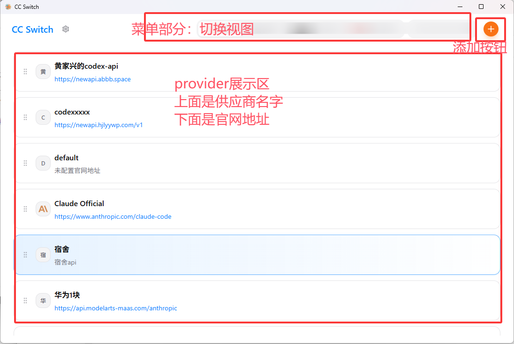
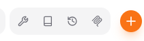
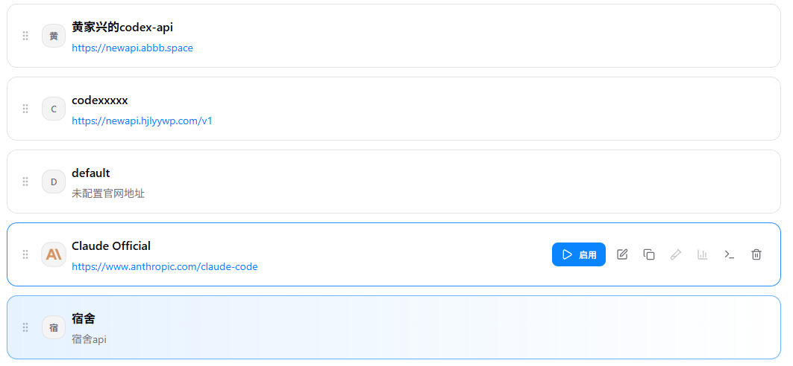
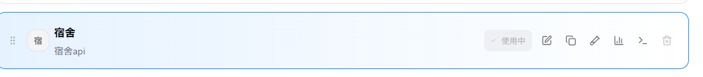

# CC Switch 前端设计方案（基于现有实现分析）

> 说明：本文基于项目当前前端代码结构进行分析，重点覆盖页面设计风格、视觉体系、信息架构与交互逻辑，并预留截图插入位置，便于后续补充成正式方案文档。

---

## 1. 项目定位与前端设计目标

管理 Provider、MCP、Skills、Prompts等能力。

因此，这个项目的前端设计目标可以概括为四点：

1. **高密度信息下的可读性**：功能多，但页面不能乱。
2. **桌面工具语义明确**：强调控制、切换、状态反馈，而不是营销感。
3. **跨模块一致性**：不同功能面板保持统一的布局语言和组件规范。
4. **轻量动效 + 强状态感知**：通过颜色、边框、徽标、Toast、过渡动画表达“当前状态”。

从当前实现看，项目已经形成了较成熟的“**桌面控制台 + 轻玻璃拟态 + 卡片化管理界面**”风格。

---

## 2. 整体视觉风格分析

## 2.1 风格关键词

结合样式系统与页面结构，当前前端风格可以总结为：

- **系统原生感**
- **轻拟态 / 玻璃感**
- **工具型极简**
- **卡片式管理界面**
- **深浅主题一致设计**
- **以状态色驱动交互反馈**

它不是追求炫技的视觉设计，而是偏向**可靠、克制、强调操作效率**的产品设计。

## 2.2 色彩体系

项目使用 CSS Variables + Tailwind token 的方式管理主题色

### 主色特征

1. **Primary 为高识别度蓝色**
   - `--primary` / 自定义 `blue-500 #0A84FF`
   - 用于主按钮、聚焦态、当前项高亮、交互强调

2. **中性色占主导**
   - 浅色主题：白底 + 灰边 + 浅灰 hover

3. **语义色分工明确**
   - 绿色：活跃 / takeover / 成功 / 健康态
   - 红色：删除 / 失败 / 风险操作
   - 琥珀色：提示 / 备份 / 警示类信息

### 设计结论

当前色彩系统非常适合桌面工具产品：

- 主色不多，但辨识度高；
- 语义色使用克制，不会污染整体界面；
- 深浅主题都保持了统一的品牌感与工具感。

## 2.3 字体与文本气质

采用系统字体栈：

- `-apple-system`
- `BlinkMacSystemFont`
- `Segoe UI`
- `Roboto`
- `Helvetica Neue`
- `Arial`

这说明项目有明确倾向：**优先保证桌面端原生感与稳定性，而不是强调品牌化字体个性**。

- 不抢功能信息的注意力；

文本层级也比较清晰：

- 页面标题：`text-lg font-semibold`
- 卡片标题：`text-base font-semibold`
- 描述信息：`text-sm text-muted-foreground`
- 辅助信息 / 标签：`text-xs` 或 `text-[10px]`

整体文本语言是偏**工具化、低装饰、高信息密度**的。

## 2.4 圆角、边框、阴影与“玻璃感”

视觉层次主要通过以下方式建立：

- 圆角：`rounded-lg / rounded-xl`
- 边框：大量使用 `border-border-default`
- 阴影：轻量 `shadow-sm / shadow-md`
- 半透明背景与模糊：`glass`、`glass-card`、`bg-background/80 + backdrop-blur-md`

这套视觉语言的特征是：

1. **不是强拟物，只是轻玻璃化**：重点在于柔化层次，而不是制造复杂质感。
2. **边框比阴影更重要**：更像专业工具，而非消费级内容卡片。
3. **标题栏、卡片、弹窗的材质语言统一**：没有模块之间明显割裂。

---

## 3. 动效与状态表达方式

## 3.1 动效风格

项目使用 `framer-motion` 和少量 CSS 动画，整体策略偏克制：

- 页面切换淡入淡出
- Provider 列表切换淡入
- 搜索浮层出现动画
- 设置页分区进入动画
- 全局主题切换圆形扩散动画

### 动效特点

1. **以过渡为主，而非表演为主**：帮助理解状态变化，而不打断操作。
2. **时间较短**：0.15s~0.4s 为主，符合工具型产品节奏。
3. **动效主要承担“上下文切换提示”**：比如视图切换、展开收起、搜索层唤出。

## 3.2 状态表达方式

项目非常依赖“颜色 + 边框 +标签 + Toast”表达状态：

- 当前项蓝色边框
- takeover / failover 活跃项绿色边框
- OMO / Slim / Hermes Managed 等标签
- 健康状态徽标、优先级徽标
- 成功/失败 Toast
- ConfirmDialog 的 destructive/info 语义区分

这意味着当前设计不是依靠复杂图形表达状态，而是依靠**一套稳定的状态视觉语法**。

## 4. 信息架构与页面组织方式

## 4.1 顶层结构：单壳层应用

## 4.2 页面骨架布局

主界面布局结构非常清楚：

1. **顶部拖拽区 / 窗口控制区**
2. **固定 Header**
3. **主内容区 Main**
4. **底层弹窗与全屏面板**

### Header 的信息分区

Header 实际承担了很多导航职责：

- 左侧：品牌 / 返回按钮 / 当前页面标题
- 中右： 控件
- 右侧：App 切换器、功能入口按钮组、主新增按钮

这不是传统 Web 顶栏，而更接近**桌面工作台工具条**。

## 4.3 子模块进入方式

当前项目使用三种进入方式，层级关系很明确：

1. **主视图切换**：如 Providers、、MCP、Skills、
2. **全屏子面板**：用于更完整的模块操作（如 PromptFormPanel / FullScreenPanel 模式）
3. **模态弹窗**：用于添加、编辑、确认、轻量配置

这三层结构很好地避免了“所有事情都塞进一个弹窗”或者“所有事情都跳转新页”的混乱。

---

## 5. 典型页面设计分析

## 5.1 Provider 管理页：整个产品的核心操作面

Provider 页是最重要的主界面，设计上具备以下特征：

### 1）导航

- 第一层：`Switcher` 切换不同功能

这种设计让“应用维度”和“功能维度”并列存在，适合多产品聚合型工具。

### 2）主操作非常突出

新增 Provider 使用橙色圆形按钮：

在整体偏蓝灰的视觉环境中，橙色按钮非常醒目，体现“主行动入口”的语义。

### 3）列表采用卡片化设计

Provider 列表每一项都是状态丰富的卡片：

- 图标
- 名称
- 标签
- URL / notes
- 配额 / usage 信息
- hover 后出现的操作按钮组

关键代码：

### 4）操作默认隐藏，悬停显露

`ProviderActions` 被放在 hover / focus-within 时出现：

这样做的优点：

- 平时信息更干净；
- 高级操作不抢主信息；
- 鼠标型桌面环境下效率较高。

### 5）状态边框设计有效

Provider 卡片的选中逻辑不是单一的，而是根据业务状态变化：

- 普通当前项：蓝边框
- takeover + active：绿边框
- additive mode 中已在 config 的项：持续高亮
- failover 队列还有优先级标记

这让用户可以一眼看清“当前使用中”“已加入配置”“代理实际生效项”等差异。

>

>

## 5.3 Prompts / MCP / Skills：统一管理面板范式

这些页面虽然业务不同，但设计模式很统一：

- 顶部统计/概览条
- 中部列表区
- 空状态视图
- 弹窗或表单面板进行增删改
- 顶栏按钮触发导入、添加、发现等动作

这说明项目已经形成了可复用的“**管理型面板模板**”：

1. 概览信息先行；
2. 列表为主；
3. 空状态友好；
4. 主操作永远可达；
5. 二级动作放在 hover 或弹窗里完成。

---

## 6. 交互逻辑分析

## 6.1 导航交互逻辑

### 1）记忆用户上次工作上下文

项目会记录：

- 上次选中的 app：
- 上次所在 view：

这是非常典型且合理的桌面工具交互：用户重开应用后能快速回到工作上下文。

### 2）返回逻辑清晰

- 非 providers 视图显示返回按钮
- `Esc` 可返回上一层或回到 providers
- `skillsDiscovery` 的返回目标是 `skills`

关键代码：`src/App.tsx:601-626, 1143-1178`

这说明产品在“层级返回”上是有明确语义的，而不是简单关闭当前页。

## 6.2 列表交互逻辑

Provider 列表是高交互密度区域，逻辑包括：

- 搜索过滤
- 拖拽排序
- 切换当前 Provider
- 编辑 / 删除 / 复制
- 流测试确认
- 故障转移队列切换
- usage 信息展开/收起

关键代码：

### 交互特点

1. **复杂操作收敛在单卡片内完成**；
2. **列表不需要跳转即可完成大多数核心任务**；
3. **危险动作都有确认机制**；
4. **测试、同步、导入等异步操作均有反馈**。

## 6.3 异步交互与反馈机制

项目的异步交互模式很一致：

- Query 拉数据
- Mutation 写数据
- Tauri event 监听后端状态变化
- Toast 实时反馈结果

### 主要反馈手段

- 成功：`toast.success`
- 失败：`toast.error`
- 警告：`toast.warning`
- 加载中：skeleton / spinner / disabled button
- 风险动作：`ConfirmDialog`

这一套机制使前端不只是展示层，而是一个**前后端事件协同的操作控制台**。

## 6.4 主题与平台交互逻辑

主题不是简单切 CSS class，而是做了更完整的桌面体验处理：

- 同步原生窗口主题：
- 切换时使用圆形扩散动画：

此外，标题栏拖拽区、窗口控制按钮、平台差异样式也被纳入设计：

说明这个项目前端设计是**把“桌面应用容器”本身也当作设计对象**，而不只是网页内容。

---

## 8. 可作为方案输出的设计结论

如果把现有前端提炼成正式设计方案，可以将其定义为：

> **一个以多工具配置管理为核心场景的桌面控制台设计体系。**
>
> 其视觉上采用“系统原生 + 轻玻璃卡片”的克制风格，交互上强调状态清晰、路径短、反馈即时，结构上通过单壳层、动态工具条、卡片列表与配置面板实现多模块统一管理。

可以进一步提炼出以下设计原则：

### 设计原则 1：控制优先于展示
所有界面首先服务于操作效率，而不是视觉表演。

### 设计原则 2：状态必须可见
当前选中、代理接管、故障转移、健康状态、只读状态都必须一眼可辨。

### 设计原则 3：复杂配置分层展开
顶层导航解决找入口，局部面板解决看细节，弹窗解决单次任务。

### 设计原则 4：跨模块统一但允许业务特化
基础结构统一，OpenClaw / Hermes 等特定应用可拥有自己的功能入口和面板。

其他管理页面均参考provider界面，
